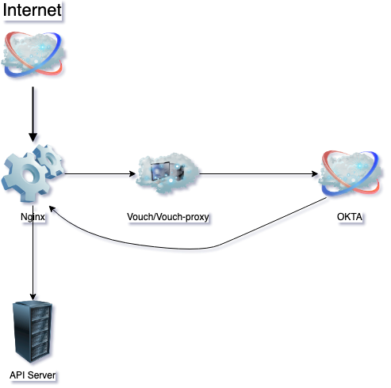
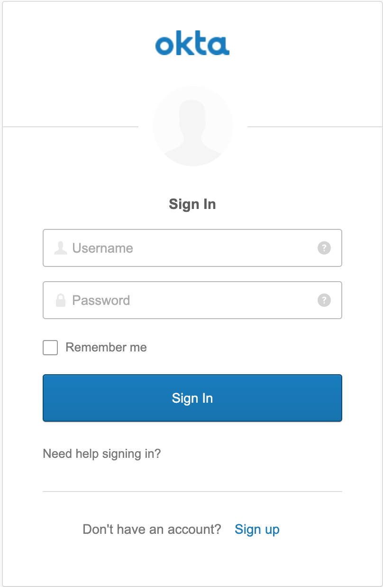
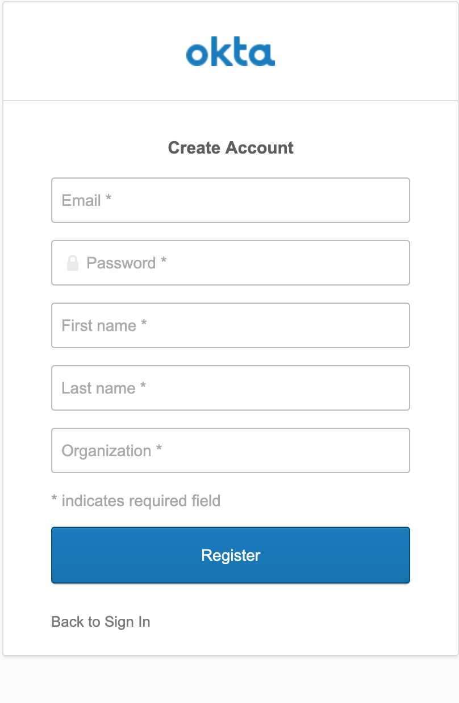

# API authentication

With an existing api server, we want to add a separated authentication layer.

## Solution

By using Nginx, vouch and okta, to build a flexible authentication layer with sepration concerns in mind.

In the above diagram, we use the `auth_request` module in `nginx` to send authentication request to third-party service `OKTA` before visiting the real api server.

## Running Concept

`https://cloud.cypherium.io` is a wrapper sit on the top of the api server. Currently it is an echo service, which means it just respond with the url user typed. e.g., if visiting `https://cloud.cypherium.io/hello/world`, it will reply with `You are visiting: /hello/world`.

However, there is one route need to protect which is `https://cloud.cypherium.io/private`, if the user request this url, it will lead user to a `sign-in` page, if user doesn't have the existing credential, user can click `sign-up` to create a new account.
| Sing In | Sign Up |
| ======= | ======= |
|  | |
